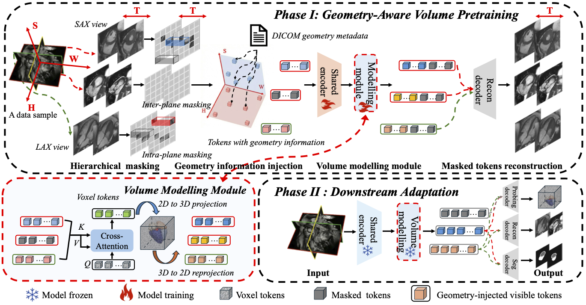

# Geometry-Aware CMR Pre-training
 
> Official PyTorch implementation of **"Geometry-Aware Cardiac MRI Pretraining via Multi-View Masked Autoencoding"**
 
[](https://www.python.org/downloads/)
[](https://pytorch.org/)
[](LICENSE)
 
---
 
📖 Overview
 

 
📁 Repository Structure
 
```
Geometry_Aware_CMR_Pretraining/
├── data/                         # Dataset loaders & Raw → .npz data conversion
│   └── build_dataset.py          # Unified preprocessing pipeline
│
├── pretrain_stage/               # Pre-training stage
│   ├── main_pretrain.py
│   ├── modeling_pretrain.py      # Model definitions (tiny/small, patch4/patch8)
│   ├── engine_for_pretraining.py
│   └── config/
│       └── pretrain.yaml
│
├── downstream_stage/             # Downstream evaluation
│   ├── seg/                      # Cardiac segmentation fine-tuning
│   │   ├── main_segmentation.py
│   │   ├── modeling_segementation.py
│   │   ├── engine_for_segmentation.py
│   │   ├── decoder/
│   │   └── config/
│   │       ├── segmentation.yaml
│   │       └── finetune_seg.yaml
│   │
│   ├── probing/                  # Linear / attentive probing
│   │   ├── main_finetune.py
│   │   ├── modeling_finetune.py
│   │   ├── visualize_voxel_probe.py
│   │   └── config/
│   │       ├── finetune.yaml
│   │       └── probing.yaml
│   │
│   └── interplane_recon/         # Inter-plane reconstruction probing
│       ├── probe_interplane_recon.py
│       └── config/
│           └── interplane_recon.yaml
│
├── optim/                        # Optimiser factory & LR schedules
├── utils/                        # Misc utilities, distributed helpers
└── fig/                          # Figures for the paper
```
 
---
 
🛠️ Environment Setup
 
```bash
conda create -n cmr python=3.9 -y
conda activate cmr
 
# 1. Install PyTorch (adjust cu118 to match your system's CUDA version)
pip install torch torchvision --index-url https://download.pytorch.org/whl/cu118
 
# 2. Install repository as an editable package along with its dependencies
# (This will automatically read pyproject.toml and install all required packages)
pip install -e .
```
 
Core dependencies included: `nibabel`, `einops`, `omegaconf`, `timm`, `scikit-image`, `scikit-learn`, `tqdm`, `monai`, `imageio`, `matplotlib`, `scipy`. Or, you can manually install them via `pip install -r requirements.txt`.
 
---
 
🗄️ Step 1: Data Preprocessing
 
Convert raw multi-modal CMR data (NIfTI + DICOM JSON + nnUNet segmentations) into standardised `.npz` files suitable for training.
 
```bash
python data/build_dataset.py \
    --data_dir /path/to/raw_data \
    --output_dir /path/to/train_data \
    --instance Instance_2 \
    --expected_t 50 \
    --crop_size 112 \
    --seg_label 2 \
    --workers 16
```
 
| Argument | Description | Default |
|---|---|---|
| `--data_dir` | Root directory of raw patient folders | *required* |
| `--output_dir` | Output directory for `.npz` files | *required* |
| `--instance` | Sub-folder name inside each patient dir | `Instance_2` |
| `--expected_t` | Expected number of temporal frames | `50` |
| `--crop_size` | Centre-crop spatial dimension | `112` |
| `--seg_label` | nnUNet label used to compute the crop centre | `2` |
| `--workers` | Parallel CPU processes | `16` |
 
Failed cases are logged to `<output_dir>/failed_processing_logs.txt`.
 
---
 
🚀 Step 2: Pre-training
 
### Available Model Variants
 
| Model name | Patch size | Tubelet size | Params |
|---|---|---|---|
| `pretrain_multivideomae_tiny_patch4_112` | 4×4 | 8 | ~5.5 M |
| `pretrain_multivideomae_tiny_patch8_112` | 8×8 | 8 | ~5.5 M |
| `pretrain_multivideomae_small_patch8_112` | 8×8 | 8 | ~25.3 M |
 
Edit `pretrain_stage/config/pretrain.yaml` to select the model and set data paths, then run:
 
```bash
# Single GPU
python pretrain_stage/main_pretrain.py \
    --config pretrain_stage/config/pretrain.yaml
 
# Multi-GPU (DDP)
torchrun --nproc_per_node=4 pretrain_stage/main_pretrain.py \
    --config pretrain_stage/config/pretrain.yaml
```
 
Key config fields:
 
```yaml
module:
  module_name: "pretrain_multivideomae_tiny_patch4_112"   # model variant
 
data:
  processed_dir: "/path/to/train_data"
  batch_size: 2
  mask_ratio: 0.75
```
 
---
 
🎯 Step 3: Downstream Tasks
 
All downstream tasks are launched from the **project root** using the corresponding script inside `downstream_stage/`.
 
### 3a. Cardiac Segmentation (`seg`)
 
Fine-tune the pre-trained encoder with a lightweight decoder for 5-class cardiac segmentation (`LVBP`, `LVMYO`, `RVBP`, `LABP`, `RABP`).
 
```bash
# Single GPU
python downstream_stage/seg/main_segmentation.py \
    --config downstream_stage/seg/config/segmentation.yaml
 
# Multi-GPU (DDP)
torchrun --nproc_per_node=4 downstream_stage/seg/main_segmentation.py \
    --config downstream_stage/seg/config/segmentation.yaml
```
 
Key config fields:
 
```yaml
general:
  ckpt_path: "/path/to/pretrain_checkpoint.pth"
  freeze_encoder: false     # true for linear probing, false for full fine-tuning
```
 
### 3d. Sliding Window Inference (`seg`)
 
For large volumes that exceed the model's standard input dimensions (e.g., more than 6+3 slices or different temporal lengths), use the sliding window inference script. This script automatically handles temporal interpolation and spatial overlapping.
 
```bash
python downstream_stage/seg/inference_sliding_window.py \
    --data_path /path/to/data.npz \
    --checkpoint /path/to/fine-tuned-segmentation-model.pth \
    --decoder unetr \
    --out_dir results/sliding_window
```
 
| Argument | Description | Default |
|---|---|---|
| `--data_path` | Path to the input `.npz` file | *required* |
| `--checkpoint` | Path to the fine-tuned segmentation `.pth` | *required* |
| `--decoder` | `unetr` (default) or `volseg` | `unetr` |
| `--out_dir` | Directory to save output NIfTI files | *required* |
 
The script generates temporal sequences of NIfTI files (`time_XX.nii.gz`) organized into the following subdirectories within `--out_dir`:
- `SAX/`: Short-axis view predictions.
- `LAX_2Ch/`, `LAX_3Ch/`, `LAX_4Ch/`: Long-axis view predictions (2-chamber, 3-chamber, and 4-chamber).
 
Additionally, it saves a single 4D NIfTI file `sax_total.nii.gz` containing all short-axis slices and temporal frames.
 
If ground truth segmentations are present in the `.npz` file, the script also calculates Dice scores for each foreground class and saves them to `<out_dir>/metrics.txt`.
 
### 3b. Linear / Attentive Probing (`probing`)
 
Freeze the encoder and train only a lightweight head for cardiac function prediction.
 
```bash
python downstream_stage/probing/main_finetune.py \
    --config downstream_stage/probing/config/probing.yaml
```
 
### 3c. Inter-Plane Reconstruction Probing (`interplane_recon`)
 
Evaluate the model's ability to reconstruct entirely **zeroed-out SAX slices** from complementary planes, quantified by PSNR and SSIM.
 
```bash
python downstream_stage/interplane_recon/probe_interplane_recon.py \
    --config downstream_stage/interplane_recon/config/interplane_recon.yaml \
    --checkpoint /path/to/pretrain_checkpoint.pth \
    --output_dir results/interplane_recon \
    --mask_type slice \
    --drop_pattern alternate \
    --num_samples 10
```
 
| Argument | Description | Default |
|---|---|---|
| `--checkpoint` | Path to pre-trained checkpoint `.pth` | *required* |
| `--mask_type` | `slice` (100% drop) or `random` (MAE-style) | `slice` |
| `--drop_pattern` | `alternate` or comma-separated indices e.g. `1,3,5` | `alternate` |
| `--mask_ratio` | Masking ratio for random masking mode | `0.75` |
| `--num_samples` | Number of validation samples to evaluate | `5` |
 
---
 
🙏 Acknowledgements
 
This project builds upon [VideoMAE](https://github.com/MCG-NJU/VideoMAE) and [MONAI](https://github.com/Project-MONAI/MONAI). We thank the authors for their excellent open-source work.